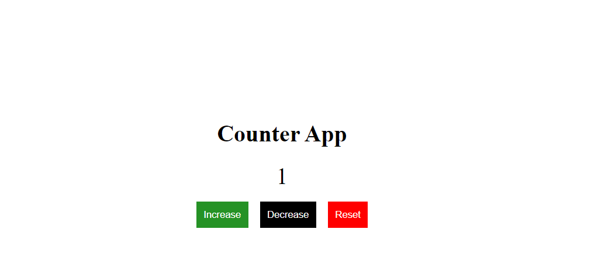

# Counter App

In this project i created counter app using front-end framework called [ReactJS](https://reactjs.org/)

I created the two components seperately called Buttons and Display for including buttons and display content respectively

Inside the `Button.jsx` component i created 3 buttons called

1.Increase:to increase the count value

2.Decrease:to Decrease the count value

3.Reset:to reset the count value

Inside the `DisplayCount.jsx` component i created the one span tag to display the value

> preview of the project

